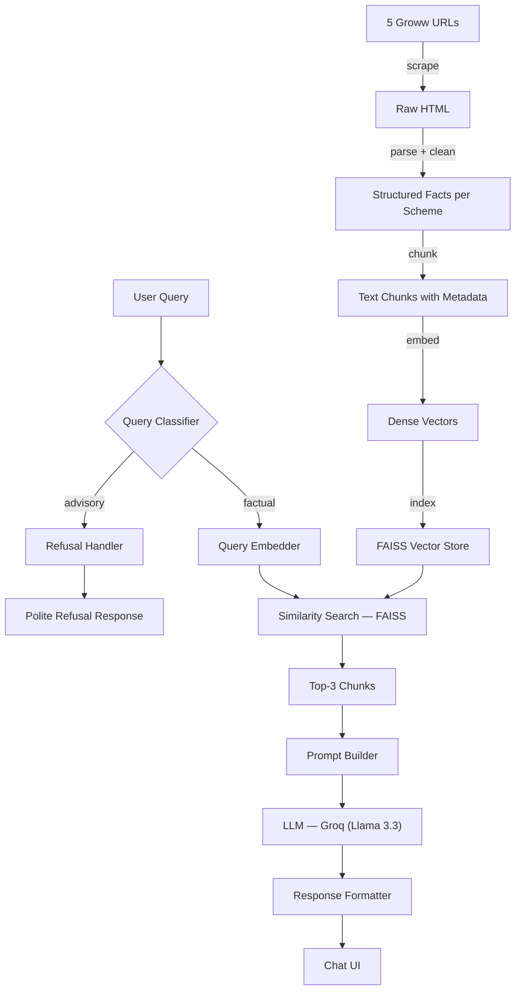

# Architecture: Mutual Fund FAQ Assistant (RAG-Based)

---

## 1. System Overview

The Mutual Fund FAQ Assistant is a **Retrieval-Augmented Generation (RAG)** pipeline that answers factual queries about 5 HDFC mutual fund schemes. It scrapes structured data from Groww scheme pages, stores embedded chunks in a vector database, and uses an LLM to generate concise, source-cited, facts-only responses.

> **Design Philosophy:** Accuracy over intelligence. The system retrieves before it generates — the LLM is constrained to answer only from retrieved context, never from parametric knowledge.

---

## 2. High-Level Architecture

```
┌─────────────────────────────────────────────────────────────────────┐
│                          OFFLINE PIPELINE                           │
│                      (Run once / on refresh)                        │
│                                                                     │
│   [Groww URLs x5]                                                   │
│        │                                                            │
│        ▼                                                            │
│   [Web Scraper]  ──►  [HTML Parser / Cleaner]  ──►  [Text Chunks]  │
│                                                        │            │
│                                                        ▼            │
│                                              [Embedding Model]      │
│                                                        │            │
│                                                        ▼            │
│                                              [Vector Store (FAISS)] │
└─────────────────────────────────────────────────────────────────────┘

┌─────────────────────────────────────────────────────────────────────┐
│                          ONLINE PIPELINE                            │
│                        (Per user query)                             │
│                                                                     │
│   [User Query]                                                      │
│        │                                                            │
│        ▼                                                            │
│   [Query Classifier]                                                │
│     ├── Advisory? ──► [Refusal Handler] ──► [Polite Refusal + Link] │
│     └── Factual?  ──► [Query Embedder]                             │
│                              │                                      │
│                              ▼                                      │
│                    [Vector Store Retrieval]                         │
│                      (Top-k similar chunks)                         │
│                              │                                      │
│                              ▼                                      │
│                    [Prompt Builder]                                 │
│               (Context + Query + System Prompt)                     │
│                              │                                      │
│                              ▼                                      │
│                    [LLM (Gemini / GPT)]                             │
│                              │                                      │
│                              ▼                                      │
│                    [Response Formatter]                             │
│             (≤3 sentences + citation + footer)                      │
│                              │                                      │
│                              ▼                                      │
│                    [Chat UI]                                        │
└─────────────────────────────────────────────────────────────────────┘
```

---

## 3. Component Breakdown

### 3.1 Data Ingestion Layer (Offline)

#### Web Scraper
- **Tool:** `requests` + `BeautifulSoup` (or `Playwright` if JS rendering needed)
- **Input:** 5 Groww scheme URLs
- **Output:** Raw HTML per scheme page
- **Behaviour:**
  - Fetches each URL once at corpus build time
  - Stores raw HTML locally before parsing
  - Records scrape timestamp (used as `last updated` date in responses)

| Fund | URL |
|---|---|
| HDFC Technology Fund | `groww.in/mutual-funds/hdfc-technology-fund-direct-growth` |
| HDFC Silver ETF FoF | `groww.in/mutual-funds/hdfc-silver-etf-fof-direct-growth` |
| HDFC Defence Fund | `groww.in/mutual-funds/hdfc-defence-fund-direct-growth` |
| HDFC Liquid Fund | `groww.in/mutual-funds/hdfc-liquid-fund-direct-growth` |
| HDFC Nifty500 Multicap | `groww.in/mutual-funds/hdfc-nifty500-multicap-50:25:25-index-fund-direct-growth` |

#### HTML Parser & Cleaner
- **Tool:** `BeautifulSoup` + custom field extractor
- **Extracts structured fields:**
  - Scheme name, category, AMC
  - Expense ratio (direct plan)
  - Exit load & conditions
  - Minimum SIP / lump sum amount
  - Lock-in period (ELSS)
  - Riskometer level
  - Benchmark index
  - NAV (latest)
  - Fund manager name(s)
- **Output:** Cleaned plain-text per scheme, tagged with metadata (`scheme_name`, `source_url`, `scraped_at`)

---

### 3.2 Chunking & Embedding Layer (Offline)

#### Text Chunker
- **Strategy:** Field-based chunking (one chunk per key fact/field per scheme)
- **Why not sliding window?** Mutual fund data is structured (key-value facts), not narrative prose. Field-level chunks improve retrieval precision.
- **Chunk format:**
  ```
  [Scheme: HDFC Technology Fund]
  [Field: Expense Ratio]
  The direct plan expense ratio of HDFC Technology Fund is 0.70% (as of May 2025).
  [Source: https://groww.in/mutual-funds/hdfc-technology-fund-direct-growth]
  [Scraped: 2025-06-29]
  ```
- **Chunk size:** ~100–200 tokens per chunk
- **Overlap:** None (facts are atomic; overlap would create duplicates)

#### Embedding Model
- **Model:** `BAAI/bge-base-en-v1.5` (BGE — BAAI General Embedding, local via `sentence-transformers`)
- **Dimension:** 768
- **Input:** Each text chunk
- **Output:** Dense vector representation stored alongside chunk metadata
- **Why BGE?** State-of-the-art retrieval performance on English text; runs locally, no API cost; optimised for semantic similarity tasks

---

### 3.3 Vector Store (Offline — built once)

- **Tool:** `FAISS` (local, lightweight, no server required)
- **Index type:** `IndexFlatL2` (exact search — corpus is small, ~50–100 chunks total)
- **Stored alongside index:**
  - Chunk text
  - Source URL
  - Scheme name
  - Scrape timestamp
- **Persistence:** Saved to disk as `vector_store/faiss_index.bin` + `metadata.json`

---

### 3.4 Query Processing Layer (Online)

#### Query Classifier
- **Purpose:** Route the query before hitting the vector store
- **Implementation:** Keyword + LLM-based intent detection
- **Two outcomes:**

| Query Type | Examples | Action |
|---|---|---|
| **Factual** | "What is the expense ratio of HDFC Liquid Fund?" | Pass to retriever |
| **Advisory** | "Should I invest in HDFC Defence Fund?" | Route to Refusal Handler |

- **Advisory detection keywords:** `should I`, `is it good`, `which is better`, `recommend`, `worth investing`, `opinion`

#### Query Embedder
- Uses the same embedding model as the ingestion layer
- Embeds the incoming user query into a vector

---

### 3.5 Retrieval Layer (Online)

- **Method:** Cosine / L2 similarity search over FAISS index
- **Top-k:** Retrieve top **3 chunks** (enough context, avoids noise)
- **Filtering:** Optionally filter by `scheme_name` if the user's query explicitly names a fund
- **Output:** List of `{chunk_text, source_url, scheme_name, scraped_at}`

---

### 3.6 Prompt Builder (Online)

Assembles the final prompt sent to the LLM:

```
SYSTEM:
You are a facts-only mutual fund FAQ assistant. You answer ONLY using the
retrieved context below. Do NOT add investment advice, opinions, or
recommendations. If the answer is not in the context, say you don't know.
Every response must:
  - Be ≤ 3 sentences
  - Include exactly one source link
  - End with: "Last updated from sources: <scraped_at date>"

CONTEXT:
<chunk_1>
<chunk_2>
<chunk_3>

USER QUESTION:
<user_query>
```

---

### 3.7 LLM (Online)

- **Provider:** [Groq](https://groq.com) — ultra-fast inference API
- **Model:** `llama-3.3-70b-versatile` (via Groq API)
- **Library:** `groq` Python SDK
- **Temperature:** `0.0` — deterministic, no creativity
- **Max tokens:** `200` — enforces brevity
- **No tools / function calling** — pure text generation constrained by prompt
- **Why Groq?** Extremely low latency, free tier available, strong instruction following on Llama 3.3

---

### 3.8 Response Formatter (Online)

Post-processes the raw LLM output before sending to UI:

1. **Sentence count check** — truncate if > 3 sentences
2. **Citation injection** — append the `source_url` from the top retrieved chunk if not already present
3. **Footer injection** — append `Last updated from sources: <scraped_at>`
4. **Disclaimer reminder** — UI-level banner (not in LLM response)

**Example formatted response:**
```
The expense ratio of HDFC Technology Fund (Direct Plan) is 0.70% per annum.
This is applicable for the direct growth variant of the scheme.
Source: https://groww.in/mutual-funds/hdfc-technology-fund-direct-growth

Last updated from sources: 2025-06-29
```

---

### 3.9 Refusal Handler (Online)

Triggered when the Query Classifier detects an advisory query.

**Refusal response template:**
```
I can only share factual information about mutual fund schemes — I'm not
able to provide investment advice or recommendations.

Please consult a registered financial advisor for personalised guidance.

Facts-only. No investment advice.
```

---

### 3.10 User Interface (Minimal)

- **Type:** Single-page chat interface
- **Stack:** HTML + CSS + Vanilla JS (or Streamlit / Gradio for rapid prototyping)
- **Key UI elements:**

| Element | Description |
|---|---|
| Welcome message | "Ask me anything factual about HDFC mutual fund schemes." |
| Example questions | 3 pre-filled clickable prompts |
| Disclaimer banner | "Facts-only. No investment advice." (always visible) |
| Chat window | User input + assistant responses with source links |
| Footer | Source date on each response |

---

## 4. End-to-End Data Flow



---

## 5. Technology Stack

| Layer | Tool / Library | Reason |
|---|---|---|
| Web Scraping | `requests` + `BeautifulSoup` / `Playwright` | Lightweight; Playwright if Groww uses JS rendering |
| Text Processing | `Python` + custom parser | Full control over field extraction |
| Embedding | `BAAI/bge-base-en-v1.5` (BGE, local) | SOTA retrieval quality; no API cost; runs locally via `sentence-transformers` |
| Vector Store | `FAISS` (local) | No infra needed; corpus is small |
| LLM | `llama-3.3-70b-versatile` via **Groq API** | Ultra-fast inference, free tier, strong instruction following |
| Prompt Management | Python f-strings / `LangChain` (optional) | Simple for this scope |
| UI | Streamlit **or** HTML + Vanilla JS | Rapid prototyping vs. custom look |
| Orchestration | Python script (no heavy framework needed) | Minimal dependency overhead |

---

## 6. Directory Structure

```
rag-milestone/
├── docs/
│   ├── problemstatement.md
│   └── architecture.md
├── data/
│   ├── raw/                    # Raw HTML from each Groww page
│   └── processed/              # Cleaned text chunks + metadata JSON
├── vector_store/
│   ├── faiss_index.bin         # FAISS index (persisted)
│   └── metadata.json           # Chunk text + source URLs + timestamps
├── src/
│   ├── scraper.py              # Fetches and saves raw HTML
│   ├── parser.py               # Extracts structured facts from HTML
│   ├── chunker.py              # Creates field-level text chunks
│   ├── embedder.py             # Generates and stores embeddings
│   ├── retriever.py            # FAISS similarity search
│   ├── classifier.py           # Factual vs. advisory query detection
│   ├── prompt_builder.py       # Assembles LLM prompt
│   ├── llm.py                  # Calls Gemini / OpenAI API
│   ├── formatter.py            # Post-processes LLM output
│   └── app.py                  # Main entry point (Streamlit / Flask)
├── .env                        # API keys (never committed)
├── requirements.txt
└── README.md
```

---

## 7. Key Design Decisions

| Decision | Choice | Rationale |
|---|---|---|
| Chunking strategy | Field-level (not sliding window) | Mutual fund data is structured key-value facts, not prose |
| Vector store | FAISS (local) over Pinecone/Weaviate | No infra overhead; corpus of ~50–100 chunks doesn't need a cloud DB |
| LLM temperature | 0.0 | Eliminates hallucination risk; facts must be deterministic |
| Top-k retrieval | 3 chunks | Enough context for a ≤3-sentence answer; avoids noise injection |
| Refusal handling | Pre-LLM classification | Faster + cheaper — no need to waste LLM tokens on refused queries |
| Source citation | From retrieval metadata, not LLM | LLM cannot fabricate a URL; source is always the actual chunk origin |

---

## 8. Known Limitations

| Limitation | Description |
|---|---|
| **Groww page changes** | If Groww updates its HTML structure, the parser will break — requires re-scraping and re-indexing |
| **Static corpus** | NAV, expense ratios, and fund facts change frequently; the corpus must be refreshed periodically |
| **No real-time NAV** | Current design uses scraped NAV, not a live API feed |
| **5 schemes only** | The assistant cannot answer queries about other HDFC or non-HDFC funds |
| **No authentication** | The UI has no login — not suitable for handling personal portfolio data |
| **English only** | No multilingual support |
| **LLM context limit** | If chunks are large or top-k is increased, prompt length may approach token limits |
